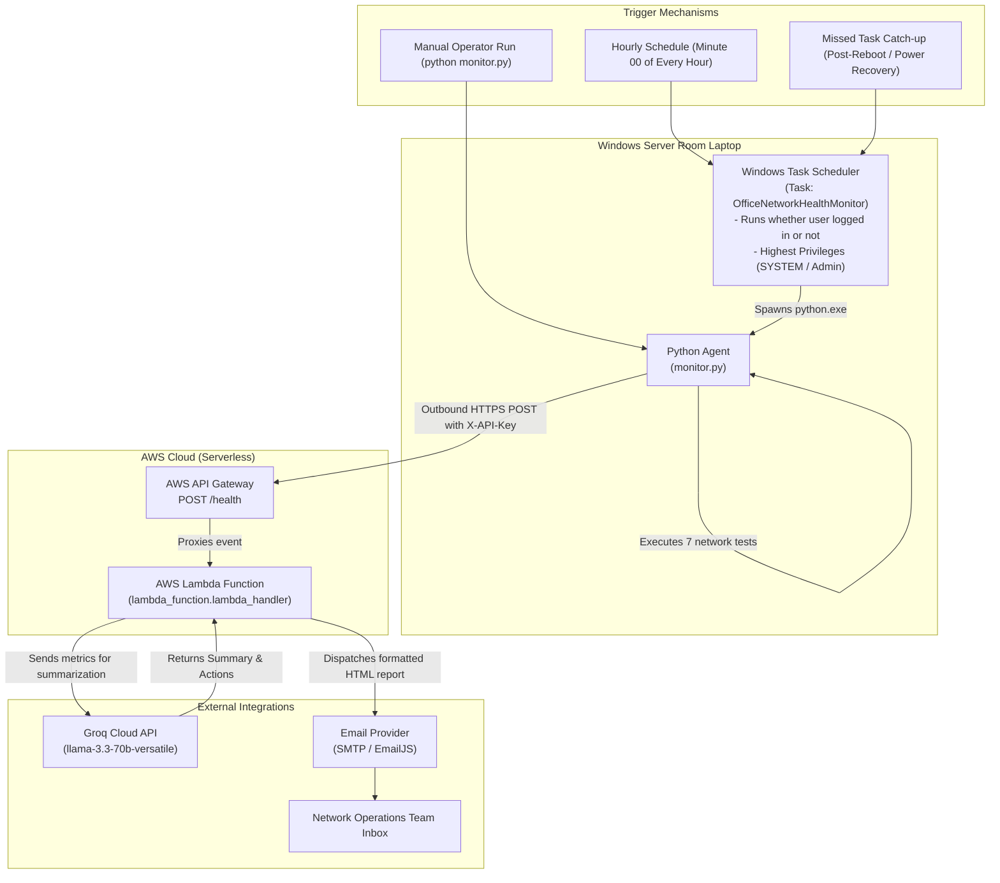
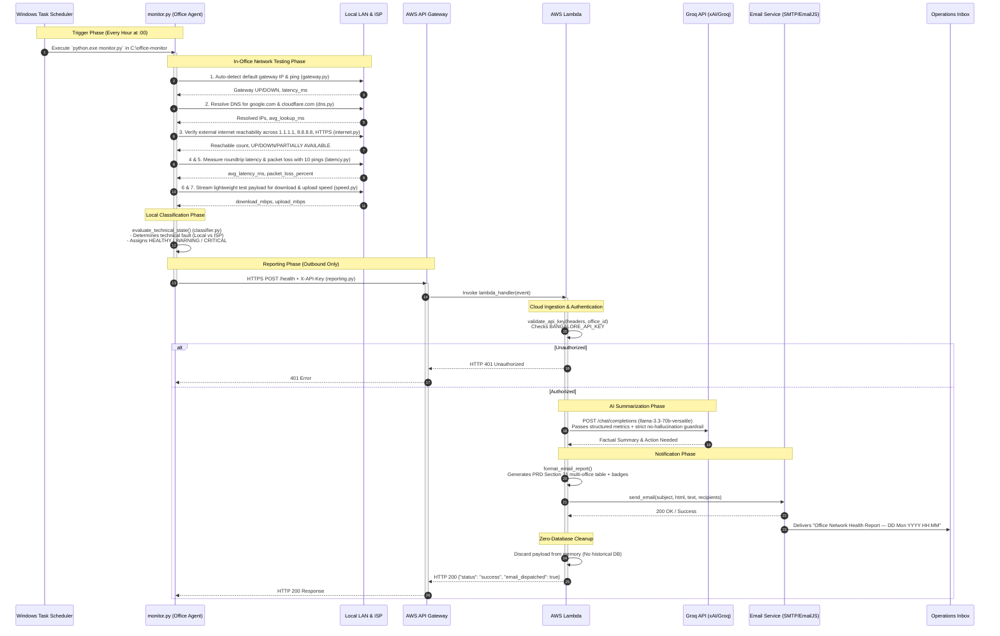
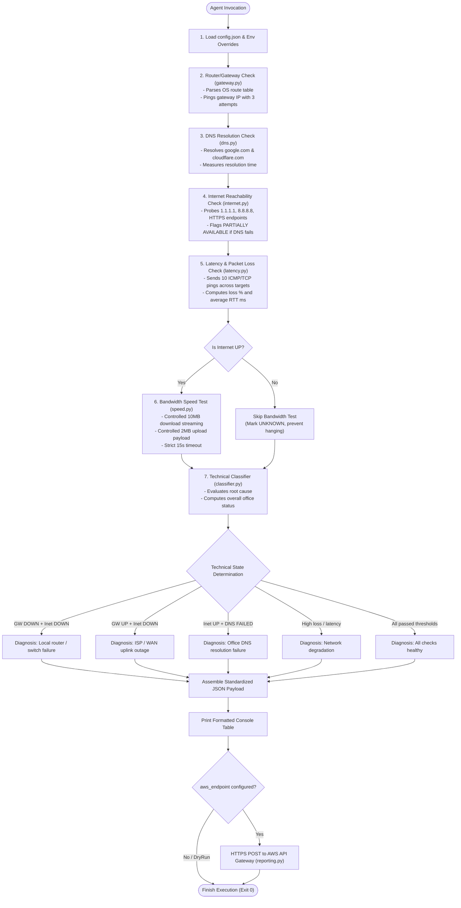
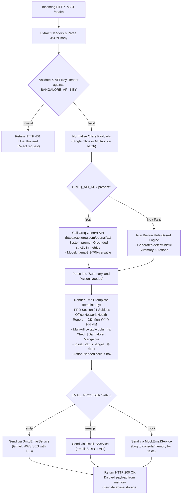

# Multi-Office Network Health Monitor — Execution Flow & Trigger Architecture

This document details the complete end-to-end execution flow, scheduling triggers, and data pipeline of the monitoring system.

---

## 1. How It Gets Triggered

The critical architectural principle is that **measurements happen from inside the office LAN**. External cloud servers cannot accurately determine if the office's local ISP is down by probing from the outside.

Therefore, the system is triggered **locally on the server room laptop** every hour:

---

## 2. End-to-End Sequence Diagram

This sequence diagram illustrates the lifecycle of a single hourly check from kickoff to report delivery:

---

## 3. In-Office Agent Execution Flow (`monitor.py`)

When `monitor.py` starts, it executes tests in a strict topological order so earlier tests inform downstream checks:

---

## 4. AWS Serverless Backend Processing Flow (`lambda_function.py`)

---

## 5. Failure Modes & Automatic Recovery

| Scenario | What Happens | Automatic Recovery / Behavior |
|---|---|---|
| **Power Outage in Office** | Laptop turns off when battery drains. No reports sent to AWS. | Once power returns, the laptop powers on automatically via **BIOS AC Power Recovery**. Windows boots to lock screen. |
| **Laptop Reboots** | System restarts for Windows updates or reboot. | **Windows Task Scheduler** runs `monitor.py` even without user login (`/ru SYSTEM`). |
| **Check Missed While Off** | Laptop was off during scheduled hour (e.g., at 02:00). | The Task Scheduler setting *"Run task as soon as possible after a scheduled start is missed"* triggers `monitor.py` immediately when Windows boots. |
| **ISP / WAN Cable Cut** | Gateway is reachable (`192.168.1.1` UP), but internet targets fail (`1.1.1.1` DOWN). | Agent classifies state as **CRITICAL - ISP / WAN outage**. When internet restores, next hourly check sends recovery report. |
| **Router Locked Up / Frozen** | Gateway IP is unreachable (`DOWN`). | Agent classifies state as **CRITICAL - Local router / switch failure**, distinguishing it from an external ISP issue. |
| **Groq API Temporary Outage** | Groq Cloud returns 5xx or times out. | Backend falls back instantly to the **deterministic rule-based generator**; email report is delivered without interruption. |
| **Temporary WiFi / LAN Glitch** | A single ping packet drops. | The agent performs multiple attempts (PRD Section 25) before classifying any check as failed. |
